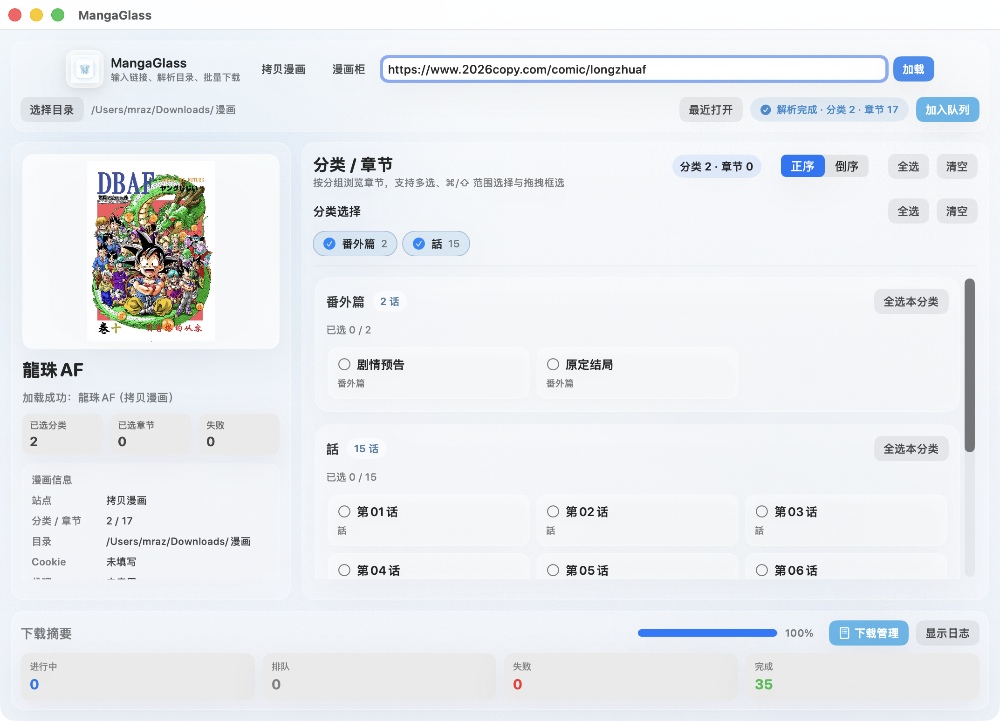

# MangaGlass

[English](./README.md)

MangaGlass 是一个面向 macOS 的本地漫画解析与下载工具，基于 SwiftUI 和 Swift Package Manager 构建。

它的核心流程很直接：

- 输入漫画详情页或章节页链接
- 解析分类、卷和章节
- 选择下载目录并加入下载队列
- 在本地管理下载、失败重试和日志

当前项目定位是桌面工具，不是通用爬虫框架，也不是后端服务。

## 当前支持站点

- 拷贝漫画系列
  - `mangacopy.com`
  - `2025copy.com`
  - `2026copy.com`
- 漫画柜
  - `manhuagui.com`
- MYCOMIC
  - `mycomic.com`

说明：

- 不同站点的页面结构、反爬策略和稳定性不同。
- 某些站点在特定网络、Cookie 或代理条件下才能稳定解析。
- 站点改版后，解析和下载逻辑可能需要跟进调整。

## 界面预览

<div align="center">
  
</div>

## 主要功能

- 支持漫画详情页、章节页链接解析
- 支持分类、卷和章节选择
- 支持批量下载、暂停、继续、取消、失败重试
- 支持下载管理页查看队列、状态和失败原因
- 支持 Cookie 与代理配置
- 支持最近打开记录
- 支持清缓存：
  - 解析缓存
  - 镜像冷却状态
  - 当前输入和解析结果
- 支持基础风控避让、局部停机和下载保护

## 环境要求

- macOS 13 或更高版本
- Xcode Command Line Tools
- Swift 6.2 工具链

如果你还没有安装命令行工具，可以先执行：

```bash
xcode-select --install
```

## 快速开始

### 本地运行

```bash
swift build
swift run MangaGlass
```

### 构建 `.app` 与 `.dmg`

```bash
./scripts/build_dmg.sh
```

构建完成后，产物位于：

- `dist/MangaGlass.app`
- `dist/MangaGlass.dmg`

## 使用方式

### 1. 加载漫画

支持以下输入方式：

- 完整漫画详情页链接
- 完整章节页链接
- 某些站点的简化 slug 或 path

常见示例：

```text
https://www.manhuagui.com/comic/19430/
https://www.2026copy.com/comic/haizeiwang
https://mycomic.com/comics/1759
https://mycomic.com/chapters/790421
```

### 2. 选择章节

- 先选择分类或卷
- 再选择单话
- 支持全选、清空、本分类全选
- 支持多选和框选

### 3. 开始下载

- 选择下载目录
- 点击加入队列
- 在下载管理中查看状态、失败项和日志

## 配置说明

### Cookie

某些站点或章节需要 Cookie 才能正常访问，可以在应用内直接填写。

适合优先排查的场景：

- 详情页能打开，但应用解析不到内容
- 章节页能打开，但下载时返回 `403`、`404` 或空内容

### 代理

应用支持在界面中配置代理，包括：

- 无代理
- HTTP
- HTTPS
- SOCKS5

如果你所在网络对目标站点访问不稳定，建议优先结合代理一起排查。

## 常用操作

### 清缓存

顶部提供 `清缓存` 按钮，会清理：

- 输入框中的当前链接
- 当前封面与漫画信息
- 已解析的分类与章节结果
- 解析相关缓存
- 镜像冷却状态

适合在站点风控、镜像异常或页面结构临时异常后手动重试。

### 下载管理

下载管理页主要用于：

- 查看排队、下载中、失败和完成数量
- 暂停所有下载
- 继续下载
- 取消所有下载
- 重新下载失败项
- 清空已完成项
- 查看失败原因与当前进度

## 项目结构

```text
Sources/MangaGlass/
  App/        应用入口、窗口设置、主状态管理
  Models/     站点、漫画、下载、代理等数据模型
  Services/   站点解析、下载调度、DOM 提取
  UI/         SwiftUI 界面
  Utils/      网络、JSON、会话等通用工具
  Resources/  应用资源

assets/
  AppIcon.icns
  logo.png
  home.png

scripts/
  build_dmg.sh
```

关键文件：

- `Sources/MangaGlass/App/MainViewModel.swift`
- `Sources/MangaGlass/Services/CopyMangaAPI.swift`
- `Sources/MangaGlass/Services/DownloadCoordinator.swift`
- `Sources/MangaGlass/UI/ContentView.swift`

## 开发说明

### 常用命令

```bash
# 调试构建
swift build

# 本地运行
swift run MangaGlass

# 打包 app 和 dmg
./scripts/build_dmg.sh
```

### 代码设计方向

- 优先简单、稳定、可维护
- 站点解析尽量收敛在服务层
- 下载逻辑和 UI 逻辑分开
- 避免为了单站点特例把公共逻辑污染得过重

## 常见问题

### 1. 解析不到章节

优先排查：

- 站点是否改版
- 当前网络是否被风控
- 是否需要 Cookie
- 是否需要先清缓存再重试

### 2. 下载全部失败或频繁 404

优先判断：

- 图片资源本身失效
- 当前站点或图片 host 进入风控
- 章节解析出的图片地址不再有效
- 代理或网络质量不稳定

### 3. 某些站点可以在浏览器打开，但应用里失败

这通常意味着：

- 浏览器里已有 Cookie，而应用里没有
- 目标站点对请求头、Referer、频率更敏感
- 当前机器或 IP 被目标站点限制

### 4. `.app` 和 `.dmg` 用哪个

项目脚本会同时生成：

- `dist/MangaGlass.app`
- `dist/MangaGlass.dmg`

二者来自同一次构建。一般直接使用 `dist/MangaGlass.app` 或 DMG 中安装的版本即可。

## 已知边界

- 解析逻辑依赖第三方站点页面结构
- 站点可能随时改版、限流或封禁
- 某些章节或图片 host 对 Referer、Cookie、请求频率较敏感
- 本项目不承诺长期稳定适配所有目标站点

## 使用说明

本项目仅用于本地学习、研究和个人使用。

请仅访问和下载你有权访问的内容。使用者需自行承担由目标站点规则、版权或网络限制带来的风险。
